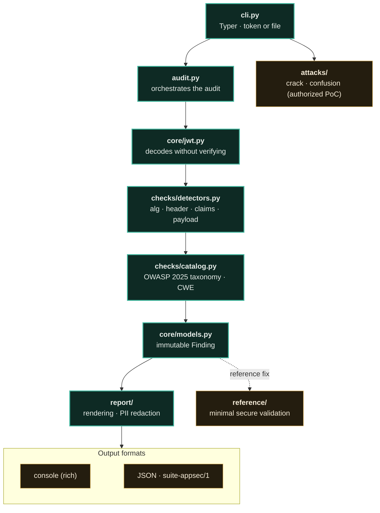

<p align="right"><a href="README.md">🇧🇷 Ler em Português</a></p>

<a href="https://paulo-marcos-lucio.github.io"></a>

<div align="center">

# 🗝️ Chaveiro
<sub>Portuguese for "Locksmith"</sub>

### Security auditor for **JWT/JWS** tokens — from diagnosis to PoC, with the fix side included.

*Decodes, audits, and attacks (with authorization) JWT tokens: `alg:none`, algorithm confusion (RS→HS), weak HMAC secret, `kid`/`jku`/`x5u` as an SSRF/injection vector, and claims validation. Includes a **minimal secure reference** for validation — because finding the flaw and showing how to fix it is the complete service.*

[](https://github.com/Paulo-Marcos-Lucio/chaveiro/actions/workflows/ci.yml)
[](https://www.python.org/)
[](LICENSE)
[](https://github.com/astral-sh/ruff)
[](https://mypy-lang.org/)
[](#-engineering-quality--method)
[](#-engineering-quality--method)
[](https://owasp.org/Top10/2025/)

</div>

---

## 📌 Why JWT breaks so often

JWT is simple to issue and **easy to validate incorrectly**. Most bypasses don't attack the cryptography — they attack the **verifier**:

- it trusts the `alg` that comes **inside the token** (accepting `none`, or swapping RS256 for HS256);
- it doesn't check `exp`/`nbf`;
- it resolves the key from a header field (`jku`/`x5u`/`jwk`) controlled by the attacker;
- it uses `kid` directly in a file path or in a SQL query.

Chaveiro covers these vectors from both sides: it **audits** a token, **proves** the flaw with a PoC when applicable, and brings a **minimal secure reference** for validation that you can mirror in your verifier.

> **Context:** I come from **Open Finance / FAPI**, where JWT/JWS (DPoP, client assertions, `id_token`) are the heart of authentication. This is the tooling I use to review this type of integration.

---

## 🔎 What it audits

| Check | Risk | Severity | OWASP 2025 / CWE |
| --- | --- | --- | --- |
| `alg-none` | Unsigned token accepted as valid | 🔴 Critical | A07 · CWE-347 |
| `alg-missing` / `alg-unknown` | Ambiguous algorithm verification | 🟠/🟡 | A07 · CWE-347 |
| `alg-hmac-advisory` | HS* → risk of weak secret and of RS→HS confusion | 🔵 Low | A04 · CWE-326 |
| `header-jku` / `header-x5u` | Key loaded from a URL in the token → **SSRF** / key injection | 🟠 High | A01 · CWE-918 |
| `header-jwk` | Embedded public key (attacker supplies their own) | 🟠 High | A07 · CWE-347 |
| `header-kid-injection` | `kid` with `../`, `'`, `;` → path traversal / SQLi | 🟠 High | A05 · CWE-91 |
| `header-zip-jws` | `zip` (compression) in a JWS — violates the RFC, opens a decompression DoS (Apache James case) | 🟠 High | A06 · CWE-409 |
| `claim-no-exp` / `claim-long-lifetime` | Token that never expires / lives too long | 🟠/🟡 | A07 · CWE-613 |
| `claim-malformed-time` | `exp`/`nbf` present but not numeric → verifier fails open | 🟡 Medium | A07 · CWE-613 |
| `claim-no-aud` / `claim-no-iss` / `claim-no-iat` | Missing binding to audience/issuer | 🔵 Low | A07 · CWE-345 |
| `header-cty-nested` / `payload-nested-jwt` | Nested JWT (`cty: JWT` or a payload that **is** another JWS) — validate both layers | 🟡/🔵 | A07 · CWE-347 |
| `payload-sensitive` | Secret/PII in the payload (JWT is base64, **not** encrypted) — also scans nested objects and CPF (Brazilian individual taxpayer ID) | 🟡 Medium | A04 · CWE-522 |

> The column cites the **OWASP Top 10:2025** code (the current edition, published on 2025-11-06). The JSON includes `owasp_edition: "2025"` and the full label on each finding.

---

## 📊 Field proof

This isn't a brochure: the numbers below come from a **labeled, version-controlled corpus** (`bench/`), reproducible with two commands — attack vectors on one side, legitimate tokens on the other. The corpus is **generated by the script itself** (no ready-made token is version-controlled) and recall comes with a **Wilson confidence interval**, because with n=22 a round number by itself announces a precision the sample can't support.

```bash
python bench/gerar.py       # generates the labeled tokens (gitignored)
python bench/avaliar.py     # measures recall + 95% CI and false positives
```

| Metric | Measured value |
| --- | --- |
| **Recall** on attack vectors | **22 / 22 = 100%** · 95% CI (Wilson) **[85% ; 100%]** — `alg:none`/missing/unknown, `jku`/`x5u`/`jwk`/`x5c`, `kid` injection, `crit`, `cty:JWT`, real nesting, claim carrying a JWT, missing `exp`/`iat`/`aud`/`iss`, expired, long lifetime, malformed time, future `nbf`, secret in payload, CPF (mod-11) |
| **False positives** on legitimate tokens | **0 / 6** — full RS256/PS256/ES256/EdDSA tokens all passed clean |
| **Resilience to a hostile token** | a JWT with deep nesting **does not bring down the batch** — it gets isolated, logged in the `error` field, and the audit of the rest continues |

The corpus **is not the field**: the tokens were planted by whoever wrote the tool, so the number measures *coverage of known vectors*, not accuracy against production traffic. See `bench/README.md` for what it covers and what it does **not** cover.

**Known false positive (transparency, not a showcase):** the `payload-sensitive` detector matches `secret` as a *substring* of the claim name, on purpose, to catch real compound forms (`client_secret`, `db_secret`, `dbSecret`). The cost is that a claim named `secretary` also gets flagged. It's a **low**-severity warning, never a bypass — but I'd rather document it here than decide for you that you wouldn't notice.

---

## 🚀 Quick start

**Prerequisite:** Python **3.10+** (CI covers 3.10 / 3.11 / 3.12). Nothing else — no service, no API key, no network: the audit is local and passive.

```bash
# 1. install directly from Git (not on PyPI — see the note in Installation)
pip install "git+https://github.com/Paulo-Marcos-Lucio/chaveiro.git"

# 2. audit a token — this public example is an alg:none (an UNSIGNED token)
echo "eyJhbGciOiJub25lIn0.eyJzdWIiOiJhZG1pbiJ9." | chaveiro inspect -
```

From zero to your first report in two commands. The output shows the `sub` claim **redacted** (LGPD, Brazil's General Data Protection Law), a **CRITICAL `alg-none`** finding, and warnings for missing claims (`exp`/`aud`/`iss`), and the process **exits with code 1** (finding ≥ `high`). For pipeline-friendly output, swap in `chaveiro inspect - -f json`. That's all it takes to get started — the rest of this README goes deeper into every command and option.

---

## 📦 Installation

Chaveiro **is not on PyPI** (`pip install chaveiro` would get you a different package, or nothing at all). Install directly from the repository:

```bash
# straight from Git (use pipx to isolate the CLI, if you prefer)
pip install "git+https://github.com/Paulo-Marcos-Lucio/chaveiro.git"

# or clone it, for development
git clone https://github.com/Paulo-Marcos-Lucio/chaveiro.git
cd chaveiro
pip install -e ".[dev]"
```

> In CI, prefer pinning a commit: `pip install "git+https://github.com/Paulo-Marcos-Lucio/chaveiro.git@<sha>"`.

---

## 🧑‍💻 Usage

```bash
# audits a token (decodes + all passive checks)
chaveiro inspect "eyJhbGciOiJub25lIn0.eyJzdWIiOiJhZG1pbiJ9."

# PREFER reading the token from stdin ('-'): passing it as an argument leaves the credential
# in the shell history and the process list (ps/EDR). That's why the argv warns about it.
echo "$TOKEN" | chaveiro inspect - -f json --fail-on high

# audits several tokens at once — ONE TOKEN PER LINE (ignores blanks/comments and a 'Bearer' prefix)
chaveiro batch tokens.txt --fail-on high        # exits 1 if any token reaches the threshold
# extract the tokens from a log before auditing (batch does not scan for a subtoken inside a line):
grep -oE 'eyJ[A-Za-z0-9_-]+\.[A-Za-z0-9_-]+\.[A-Za-z0-9_-]*' access.log | chaveiro batch - -f json

# is the HMAC secret weak? (dictionary attack — built-in list + your wordlist)
chaveiro crack "$TOKEN" --wordlist rockyou.txt

# algorithm confusion PoC: forges an HS256 using the PUBLIC key as the secret
chaveiro forge-confusion "$RS256_TOKEN" --public-key server.pub --set role=admin

# re-signs a modified token with a known secret (authorized test)
chaveiro forge "$TOKEN" --secret leaked-secret --set role=admin

# lists all checks
chaveiro regras          # 'rules' still works as an alias
```

**Exit code** (`inspect`/`batch`): `1` if the worst severity reaches `--fail-on`, otherwise `0`; `2` is a usage error (invalid option, unreadable file). The default for `--fail-on` is **`high`** — a token scanner shouldn't break a build over an informational finding. In `batch`, a malformed line is normal log noise: it goes to stderr and **does not** fail the build (use `--strict` to make it hard-fail). Accepted levels: `none | info | low | medium | high | critical`.

**Token in argv vs. stdin.** `inspect`, `crack`, `forge`, and `forge-confusion` accept `-` to read the token from **stdin** (so does `batch`). Passing the token as an argument leaks it into the shell history and the process list, so the argv **prints a warning** pointing to the safe path. Prefer stdin on any shared terminal or one with history enabled.

**Claims privacy (LGPD).** A customer's JWT routinely carries PII belonging to the **end data subject** (`sub`, `email`, `cpf`, name). By default, the report **redacts** identity claims and any value that looks like an email/CPF, while keeping visible the structural claims the audit needs (`exp`, `iat`, `nbf`, `iss`, `aud`, `jti`, `typ`, `kid`). Use `--claims-completas` to see everything in the clear — it's explicit opt-in, with a warning, because whoever records the report becomes the operator of that data.

The JSON envelope also carries `commit`, `ruleset_hash` (sha256 of the checks catalog), and `artifact_sha256` (self-verifiable), so the report can be tied back to the code and rules that produced it.

> **To recompute `artifact_sha256`:** the hash is over the JSON's **UTF-8 bytes** (the catalog is in Portuguese, with accented characters). On Windows, `open(caminho)` reads as cp1252 and produces a false "tampered" result — read the file as UTF-8 before recomputing: `open(caminho, "rb").read().decode("utf-8")`.

### Configuration — the options that matter most

None of this is mandatory: Chaveiro runs on the defaults. Change something only when the context calls for it. (`chaveiro <command> --help` lists everything.)

| Option | Where | Default | When to change |
| --- | --- | --- | --- |
| `-f, --format` | `inspect`, `batch` | `console` | `json` for consuming in a pipeline/dashboard (schema `suite-appsec/1`) |
| `--fail-on` | `inspect`, `batch` | `high` | lower it to `low`/`medium` for a strict gate; `none` to never fail the build on severity |
| `--claims-completas` | `inspect`, `batch` | off | only when you need to see the PII in the clear — opt-in with a warning, you become the LGPD data operator for the report |
| `--strict` | `batch` | off | when a malformed line **should** bring down the build (by default it's just log noise) |
| `-w, --wordlist` | `crack` | — | add your wordlist (e.g., `rockyou.txt`) to the built-in weak-secret list |
| `--no-defaults` | `crack` | off | test **only** your wordlist, without the built-in list |
| `--set key=value` | `forge`, `forge-confusion` | — | edit claims in the PoC (repeatable: `--set sub=admin --set role=admin`) |
| `--alg` | `forge`, `forge-confusion` | `HS256` | forge with a different HMAC (`HS384`/`HS512`) |
| `CHAVEIRO_COMMIT` (env) | all | `git rev-parse HEAD` | pin the provenance SHA when running from an installed package (no `.git`) |

### The fix side — minimal secure reference

```python
from chaveiro.reference.secure_validation import validate, InvalidToken

# FIXED allowlist of algorithms, rejects 'none', verifies signature + exp/nbf + aud/iss
claims = validate(
    token,
    key=public_key_pem,  # HMAC secret (HS*) or public key PEM (RS*/PS*/ES*/EdDSA)
    algorithms=["RS256"],  # never read the alg from the token
    audience="minha-api",
    issuer="https://auth.exemplo",
    typ="at+jwt",  # optional: pins the expected 'typ' (RFC 9068)
)
```

It is a **minimal secure reference**, not a complete, production-ready verifier. What it **covers**: mandatory algorithm allowlist, rejection of `none` (even if it's in the allowlist), HS*/RS*/PS*/ES*/EdDSA signature verification, `exp`/`nbf` (with `leeway`) rejecting a malformed NumericDate (fail-closed), `aud`/`iss`, `typ` when required, and **explicit failure on a nested JWT** (`cty:JWT`) instead of returning empty claims. What it does **not** cover: revocation/`jti`, key rotation and resolution (JWKS/`kid`), `azp`/`nonce`/PKCE, replay, and validating the second layer of a nested token. Adapt it to your stack — it's the material I hand the client together with the diagnosis, not a drop-in.

---

## 🔓 Pro version (private) — the engine is the same, Pro is human work

**To be clear: Pro is not a different engine.** The detector in this repository is the same one that runs in the service — there is no "souped-up engine" hidden behind a paywall, and no check that is born only in the paid version. What's public here is what does the work. The table separates what the **tool** does (you run it yourself) from what the **service** adds (human work on top of the same engine):

| | Public tool — **you run it** | Pro · service — **I run it with you** |
| --- | --- | --- |
| **Detection engine** | The same — **22/22** vectors (corpus `bench/`, 95% CI [85%;100%]), **0** false positives on 6 legitimate tokens | The **same** engine, pointed at your real authentication flow |
| **Scope** | The token you paste, or the file/log you have | Issuer **and** verifier of the entire system, plus the historical tokens in your logs |
| **Exploitation PoC** | `crack` / `forge` / `forge-confusion` on your own bench | **Authorized** PoC, with a signed scope, run in your environment and documented |
| **Fix** | Documented `reference/` module (minimal secure reference) — you adapt it to your code | Validation **implemented and tested in your stack**, delivered via PR |
| **Weak HMAC secret** | The tool flags the risk | **Rotation carried out with a retest** — I confirm the new secret holds up |
| **Knowledge transfer** | README + open source code | **Mentoring**: your team understands the why behind each bypass, not just the patch |

> The engine is the same on both sides. What you're hiring in Pro is **human time** — from someone who has built issuers and verifiers in Open Finance / FAPI — never a hidden technical feature. Every PoC is **gated**: it only runs against a system you own or with explicit written authorization.

<div align="center">

[](https://paulo-marcos-lucio.github.io)
[](https://www.linkedin.com/in/paulo-marcos-a07379174/)

</div>

---

## 🏗️ Architecture

Chaveiro answers one specific question: *would this token be accepted by a misconfigured verifier?* — and it answers before an attacker asks the same question. The data flows through a short pipeline: you pass in a token (or a file/log of tokens), it gets **decoded without verifying the signature**, the detectors scan the header, algorithm, claims, and payload, and each weakness becomes a `Finding` already classified by **OWASP 2025 / CWE**. In the end, out comes a report — on the **console** (rich) for reading, or as **JSON** (`schema suite-appsec/1`) for a pipeline. The audit is **100% passive**, it never touches the network; the attack commands (`crack`/`forge`) are separate and require authorization.



```
src/chaveiro/
├── core/        # jwt (base64url, HMAC, RS/PS/ES/EdDSA verification via cryptography), models
├── checks/      # declarative catalog + detectors (alg, header, claims, payload)
├── attacks/     # crack (HMAC dictionary attack) and confusion (RS→HS PoC)
├── reference/   # minimal secure reference, documented — the fix side
├── report/      # console (rich) and json
├── audit.py     # orchestration: audit a single token and in batch
└── cli.py       # typer interface
```

---

## 🔬 Engineering quality & method

**Gates (measured now, not promised):** **191 tests** passing (including *property-based* tests with Hypothesis) · **95%** coverage (the gate is enforced at `--cov-fail-under=90`) · `mypy --strict` clean across **20 files** · `ruff` (lint + format) clean · CI on a **Python 3.10 / 3.11 / 3.12** matrix.

**A test that goes red if detection gets silently undone.** The suite doesn't just confirm the positive case — it guards against *silent inversion*. Each detector has a negative counterpart (`_CASOS_NEGATIVOS` in `tests/test_detectors.py`): swapping `nbf > agora` for `nbf < agora` would pass any test that only looks at the positive case, but it leaves the negative one red. And a meta-test (`test_toda_checagem_do_catalogo_tem_caso_positivo`) fails the build if a new check is born without a case exercising it — human discipline turned into an invariant.

**Patterns that are actually in the code:**
- **Separation of concerns:** detection (`checks/detectors.py`, decides *when* to emit) × taxonomy (`checks/catalog.py`, the metadata) × orchestration (`audit.py`) × rendering (`report/console.py` and `report/json_report.py`).
- **Single source of truth:** the OWASP 2025 / CWE mapping for each finding lives only in `CATALOG` in `catalog.py`; the OWASP edition is an explicit constant (`OWASP_EDITION`), because `A03` means something different between 2021 and 2025.
- **Versioned output contract:** JSON with `schema: "suite-appsec/1"`, `severity_rank`, and `by_severity` always carrying all 5 keys (even the zeroed ones) — a dashboard can sort and aggregate without parsing the label.
- **Strict types and immutability:** the domain models are `@dataclass(frozen=True)` (`DecodedToken`, `Finding`, `CheckMeta`); `mypy --strict` over `src`.

**The repo's own supply chain:** CI actions are pinned by **SHA** (not by a moving tag), with **Dependabot** updating those SHAs monthly — `github-actions` and `pip`. Pinning without Dependabot would freeze the vulnerable version forever; the two pieces only make sense together.

**Portuguese in code, tests, and docs** is a deliberate choice for consistency: the same language as the report that reaches the client, with no context-switching between the finding and the recommendation.

---

## ⚖️ Ethical use

Attack tools (`crack`, `forge`, `forge-confusion`) are for **systems you own or have explicit authorization to test**. The goal is defensive: proving the flaw to justify the fix. In Brazil, unauthorized access is a crime (Law 12.737/2012, aggravated by Law 14.155/2021). Use with a defined scope — and these three commands **print this warning when they run**.

---

## 🧭 Roadmap

- [x] PS*/EdDSA signature verification in the reference.
- [x] `jwt` confusion detection via `cty`/nested tokens — including **real** nested JWTs (a payload that is itself another compact JWS, RFC 7519 §5.2).
- [x] Batch mode (audit many tokens from a file/log), resilient to a hostile token (deep nesting does not bring down the batch).
- [ ] Minimum HMAC secret length check via strength analysis.

---

## 📄 License

[MIT](LICENSE) © 2026 Paulo Marcos Lucio.

---

<div align="center">
<sub>Part of the AppSec suite — alongside <a href="https://github.com/Paulo-Marcos-Lucio/sentinela">Sentinela</a> and <a href="https://github.com/Paulo-Marcos-Lucio/guardiao">Guardião</a>.</sub>
</div>
