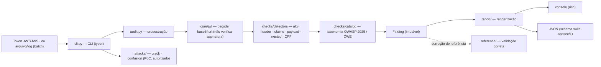

<a href="https://paulo-marcos-lucio.github.io"></a>

<div align="center">

# 🗝️ Chaveiro

### Auditor de segurança de tokens **JWT/JWS** — do diagnóstico ao PoC, com o lado da correção junto.

*Decodifica, audita e ataca (com autorização) tokens JWT: `alg:none`, confusão de algoritmo (RS→HS), segredo HMAC fraco, `kid`/`jku`/`x5u` como vetor de SSRF/injeção, e validação de claims. Inclui um módulo de **referência de validação correta** — porque encontrar a falha e mostrar como corrigir é o serviço completo.*

[](https://github.com/Paulo-Marcos-Lucio/chaveiro/actions/workflows/ci.yml)
[](https://www.python.org/)
[](LICENSE)
[](https://github.com/astral-sh/ruff)
[](https://mypy-lang.org/)
[](https://owasp.org/Top10/2025/)

</div>

---

## 📌 Por que JWT quebra tanto

JWT é simples de emitir e **fácil de validar errado**. A maioria dos bypasses não ataca a criptografia — ataca o **verificador**:

- ele confia no `alg` que vem **dentro do token** (aceitando `none`, ou trocando RS256 por HS256);
- ele não confere `exp`/`nbf`;
- ele resolve a chave a partir de um campo do cabeçalho (`jku`/`x5u`/`jwk`) controlado pelo atacante;
- ele usa `kid` direto num caminho de arquivo ou numa query SQL.

O Chaveiro cobre esses vetores dos dois lados: **audita** um token, **prova** a falha com um PoC quando aplicável, e mostra a **validação correta** como referência.

> **Contexto:** venho de **Open Finance / FAPI**, onde JWT/JWS (DPoP, client assertions, `id_token`) são o coração da autenticação. Este é o ferramental que uso para revisar esse tipo de integração.

---

## 🔎 O que ele audita

| Checagem | Risco | Severidade | OWASP 2025 / CWE |
| --- | --- | --- | --- |
| `alg-none` | Token não assinado aceito como válido | 🔴 Crítica | A07 · CWE-347 |
| `alg-missing` / `alg-unknown` | Verificação ambígua de algoritmo | 🟠/🟡 | A07 · CWE-347 |
| `alg-hmac-advisory` | HS* → risco de segredo fraco e de confusão RS→HS | 🔵 Baixa | A04 · CWE-326 |
| `header-jku` / `header-x5u` | Chave carregada de URL do token → **SSRF** / key injection | 🟠 Alta | A01 · CWE-918 |
| `header-jwk` | Chave pública embutida (atacante fornece a própria) | 🟠 Alta | A07 · CWE-347 |
| `header-kid-injection` | `kid` com `../`, `'`, `;` → path traversal / SQLi | 🟠 Alta | A05 · CWE-91 |
| `claim-no-exp` / `claim-long-lifetime` | Token eterno / longevo demais | 🟠/🟡 | A07 · CWE-613 |
| `claim-malformed-time` | `exp`/`nbf` presente mas não numérico → verificador falha aberto | 🟡 Média | A07 · CWE-613 |
| `claim-no-aud` / `claim-no-iss` / `claim-no-iat` | Falta amarração de destino/emissor | 🔵 Baixa | A07 · CWE-345 |
| `header-cty-nested` / `payload-nested-jwt` | JWT aninhado (`cty: JWT` ou payload que **é** outro JWS) — valide as duas camadas | 🟡/🔵 | A07 · CWE-347 |
| `payload-sensitive` | Segredo/PII no payload (JWT é base64, **não** cifrado) — varre também objetos aninhados e CPF | 🟡 Média | A04 · CWE-522 |

> A coluna cita o código do **OWASP Top 10:2025** (edição vigente, publicada em 2025-11-06). O JSON traz `owasp_edition: "2025"` e o rótulo completo em cada achado.

---

## 📊 Prova de campo

Não é folheto: os números abaixo foram **medidos rodando o CLI** numa bateria de execução real — vetores de ataque conhecidos de um lado, tokens legítimos do outro.

| Métrica | Valor medido |
| --- | --- |
| **Recall** em vetores de ataque | **22 / 22** — `alg:none`, confusão RS→HS, injeção em `kid`/`jku`, JWT aninhado real, CPF (mód-11) |
| **Falso-positivo** em tokens legítimos | **0** — 6 / 6 tokens bem-formados passaram limpos |
| **Throughput** (`batch`) | **24.606 tokens/s** (~40,6 µs/token) |
| **Resiliência a token hostil** | um JWT com aninhamento profundo **não derruba o lote** — é isolado, registrado no campo `error` e a auditoria dos demais segue |

**Falso-positivo conhecido (transparência, não vitrine):** o detector `payload-sensitive` casa `secret` como *substring* do nome da claim, de propósito, para pegar as formas compostas reais (`client_secret`, `db_secret`, `dbSecret`). O custo é que uma claim chamada `secretary` também é sinalizada. É um aviso de severidade **baixa**, nunca um bypass — mas prefiro documentar aqui a decidir por você que você não ia notar.

---

## 🚀 Instalação

O Chaveiro **não está no PyPI** (`pip install chaveiro` traria outro pacote ou
nada). Instale direto do repositório:

```bash
# direto do Git (use pipx para isolar o CLI, se preferir)
pip install "git+https://github.com/Paulo-Marcos-Lucio/chaveiro.git"

# ou clonando, para desenvolver
git clone https://github.com/Paulo-Marcos-Lucio/chaveiro.git
cd chaveiro
pip install -e ".[dev]"
```

> Em CI, prefira fixar um commit: `pip install "git+https://github.com/Paulo-Marcos-Lucio/chaveiro.git@<sha>"`.

---

## 🧑‍💻 Uso

```bash
# audita um token (decodifica + todas as checagens passivas)
chaveiro inspect "eyJhbGciOiJub25lIn0.eyJzdWIiOiJhZG1pbiJ9."

# em JSON, para pipelines
chaveiro inspect "$TOKEN" -f json --fail-on high

# audita vários tokens de uma vez — UM TOKEN POR LINHA (ignora branco/comentário e prefixo 'Bearer')
chaveiro batch tokens.txt --fail-on high        # sai 1 se algum token atingir o limiar
# extraia os tokens de um log antes de auditar (o batch não varre subtoken dentro da linha):
grep -oE 'eyJ[A-Za-z0-9_-]+\.[A-Za-z0-9_-]+\.[A-Za-z0-9_-]*' access.log | chaveiro batch - -f json

# o segredo HMAC é fraco? (ataque de dicionário — lista embutida + sua wordlist)
chaveiro crack "$TOKEN" --wordlist rockyou.txt

# PoC de confusão de algoritmo: forja um HS256 com a chave PÚBLICA como segredo
chaveiro forge-confusion "$RS256_TOKEN" --public-key server.pub --set role=admin

# reassina um token modificado com um segredo conhecido (teste autorizado)
chaveiro forge "$TOKEN" --secret leaked-secret --set role=admin

# lista todas as checagens
chaveiro regras          # 'rules' continua funcionando como alias
```

**Código de saída** (`inspect`/`batch`): `1` se a pior severidade atingir
`--fail-on`, senão `0`; `2` é erro de uso (opção inválida, arquivo ilegível). O
default de `--fail-on` é **`high`** — um scanner de token não deve derrubar um
build por um achado informativo. No `batch`, linha malformada é ruído normal de
log: vai para o stderr e **não** falha o build (use `--strict` para travar
nela). Níveis aceitos: `none | info | low | medium | high | critical`.

### O lado da correção — validação de referência

```python
from chaveiro.reference.secure_validation import validate, InvalidToken

# allowlist FIXA de algoritmos, rejeita 'none', confere assinatura + exp/nbf + aud/iss
claims = validate(
    token,
    key=public_key_pem,  # segredo HMAC (HS*) ou chave pública PEM (RS*/PS*/ES*/EdDSA)
    algorithms=["RS256"],  # nunca leia o alg do token
    audience="minha-api",
    issuer="https://auth.exemplo",
)
```

O que torna essa função segura está documentado nela mesma — é o material que entrego ao cliente junto do diagnóstico.

---

## 🔓 Versão Pro (privada) — o motor é o mesmo, o Pro é trabalho humano

**Para não haver dúvida: o Pro não é um motor diferente.** O detector deste repositório é o mesmo que roda no serviço — não existe "engine turbinada" escondida atrás de paywall, nem checagem que só nasce na versão paga. O que está público aqui é o que faz o trabalho. A tabela separa o que a **ferramenta** faz (você roda sozinho) do que o **serviço** acrescenta (trabalho humano sobre a mesma engine):

| | Ferramenta pública — **você roda** | Pro · serviço — **eu conduzo com você** |
| --- | --- | --- |
| **Motor de detecção** | O mesmo — **22/22** vetores, **0** falso-positivo, **24.606 tokens/s** | O **mesmo** motor, apontado para o seu fluxo real de autenticação |
| **Escopo** | O token que você colar, ou o arquivo/log que você tiver | Emissor **e** verificador do sistema inteiro, mais o histórico de tokens em log |
| **PoC de exploração** | `crack` / `forge` / `forge-confusion` na sua bancada | PoC **autorizado**, com escopo assinado, rodado no seu ambiente e documentado |
| **Correção** | Módulo `reference/` documentado — você adapta ao seu código | Validação de referência **implementada e testada no seu stack**, entregue via PR |
| **Segredo HMAC fraco** | A ferramenta aponta o risco | **Rotação conduzida com reteste** — confirmo que o novo segredo resiste |
| **Transferência** | README + código-fonte aberto | **Mentoria**: seu time entende o porquê de cada bypass, não só o patch |

> A engine é a mesma dos dois lados. O que você contrata no Pro é **tempo humano** — de quem construiu emissor e verificador em Open Finance / FAPI — nunca um recurso técnico escondido. Todo PoC é **gated**: só roda em sistema seu ou com autorização explícita por escrito.

<div align="center">

[](https://paulo-marcos-lucio.github.io)
[](https://www.linkedin.com/in/paulo-marcos-a07379174/)

</div>

---

## 🏗️ Arquitetura

O Chaveiro resolve uma pergunta específica: *este token seria aceito por um verificador mal configurado?* — e responde antes que um atacante faça a mesma pergunta. O dado percorre um pipeline curto: você passa um token (ou um arquivo/log de tokens), ele é **decodificado sem verificar assinatura**, os detectores varrem cabeçalho, algoritmo, claims e payload, e cada fraqueza vira um `Finding` já classificado por **OWASP 2025 / CWE**. No fim sai um relatório — no **console** (rich) para ler, ou em **JSON** (`schema suite-appsec/1`) para pipeline. A auditoria é **100% passiva**, não toca a rede; os comandos de ataque (`crack`/`forge`) são separados e exigem autorização.



```
src/chaveiro/
├── core/        # jwt (base64url, HMAC, verificação RS/PS/ES/EdDSA via cryptography), modelos
├── checks/      # catálogo declarativo + detectores (alg, header, claims, payload)
├── attacks/     # crack (dicionário HMAC) e confusion (PoC RS→HS)
├── reference/   # validação CORRETA, documentada — o lado da correção
├── report/      # console (rich) e json
├── audit.py     # orquestração: auditar um token e em lote (batch)
└── cli.py       # interface typer
```

---

## 🔬 Qualidade de engenharia & método

**Portões (medidos agora, não prometidos):** **126 testes** verdes · cobertura **94%** (o gate trava em `--cov-fail-under=90`) · `mypy --strict` limpo em **18 arquivos** · `ruff` (lint + format) limpo · CI em matriz **Python 3.10 / 3.11 / 3.12**.

**Teste que fica vermelho se a detecção for desfeita.** A suíte não confirma só o caso positivo — guarda a *inversão silenciosa*. Cada detector tem um par negativo (`_CASOS_NEGATIVOS` em `tests/test_detectors.py`): trocar `nbf > agora` por `nbf < agora` passa em qualquer teste que só olhe o positivo, mas deixa o negativo vermelho. E um meta-teste (`test_toda_checagem_do_catalogo_tem_caso_positivo`) reprova o build se uma checagem nova nascer sem caso que a exercite — disciplina humana virou invariante.

**Padrões que estão de fato no código:**
- **Separação de responsabilidades:** detecção (`checks/detectors.py`, decide *quando* emitir) × taxonomia (`checks/catalog.py`, os metadados) × orquestração (`audit.py`) × renderização (`report/console.py` e `report/json_report.py`).
- **Fonte única de verdade:** o mapa OWASP 2025 / CWE de cada achado vive só no `CATALOG` de `catalog.py`; a edição do OWASP é constante explícita (`OWASP_EDITION`), porque `A03` muda de significado entre 2021 e 2025.
- **Contrato de saída versionado:** JSON com `schema: "suite-appsec/1"`, `severity_rank` e `by_severity` sempre com as 5 chaves (inclusive zeradas) — um painel ordena e agrega sem fazer parsing do rótulo.
- **Tipos estritos e imutabilidade:** os modelos de domínio são `@dataclass(frozen=True)` (`DecodedToken`, `Finding`, `CheckMeta`); `mypy --strict` sobre `src`.

**Cadeia de suprimentos do próprio repo:** as actions do CI são fixadas por **SHA** (não por tag móvel), com o **Dependabot** atualizando esses SHAs mensalmente — `github-actions` e `pip`. Fixar sem Dependabot congelaria a versão vulnerável para sempre; as duas peças só fazem sentido juntas.

**PT-BR em código, teste e doc** é decisão consciente de consistência: o mesmo idioma do relatório que chega ao cliente, sem troca de contexto entre o achado e a recomendação.

---

## ⚖️ Uso ético

Ferramentas de ataque (`crack`, `forge`, `forge-confusion`) são para **sistemas que você possui ou tem autorização explícita para testar**. O objetivo é defensivo: comprovar a falha para justificar a correção. No Brasil, acesso não autorizado é crime (Lei 12.737/2012, agravada pela Lei 14.155/2021). Use com escopo definido — e esses três comandos **imprimem esse aviso ao rodar**.

---

## 🧭 Roadmap

- [x] Verificação de assinatura PS*/EdDSA na referência.
- [x] Detecção de `jwt` confusion via `cty`/nested tokens — inclusive JWT aninhado **real** (payload que é outro JWS compacto, RFC 7519 §5.2).
- [x] Modo batch (auditar muitos tokens de um arquivo/log), resistente a token hostil (aninhamento profundo não derruba o lote).
- [ ] Checagem de tamanho mínimo de segredo HMAC por análise de força.

---

## 📄 Licença

[MIT](LICENSE) © 2026 Paulo Marcos Lucio.

---

<div align="center">
<sub>Parte da suíte AppSec — junto do <a href="https://github.com/Paulo-Marcos-Lucio/sentinela">Sentinela</a> e do <a href="https://github.com/Paulo-Marcos-Lucio/guardiao">Guardião</a>.</sub>
</div>
